[简体中文](./README.zh-CN.md) · [Website](https://automem.lei6393.com) · [GitHub](https://github.com/SuperMarioYL/automem)

<picture>
  <source media="(max-width: 600px) and (prefers-color-scheme: dark)" srcset="./assets/presentation/hero-mobile-dark.svg">
  <source media="(max-width: 600px)" srcset="./assets/presentation/hero-mobile-light.svg">
  <source media="(prefers-color-scheme: dark)" srcset="./assets/presentation/hero-dark.svg">
  
</picture>

# automem

**Carry useful session context into the next restart.**

automem extracts user messages and file references from a session transcript, stores them locally, and retrieves relevant summaries through a short-lived CLI.

## Why use it

Repeatedly pasting the same project decisions is tedious. Save the source transcript once and recall matching context when you need it; no embedding service or model request is needed for the local path.

- **Offline local memory** — Capture and recall need no key or daemon.
- **Inspectable summaries** — Extracted text and paths remain in JSONL.
- **Preview integration** — install --dry-run shows hook or wrapper changes.

## Architecture

<picture>
  <source media="(max-width: 600px) and (prefers-color-scheme: dark)" srcset="./assets/presentation/architecture-mobile-dark.svg">
  <source media="(max-width: 600px)" srcset="./assets/presentation/architecture-mobile-light.svg">
  <source media="(prefers-color-scheme: dark)" srcset="./assets/presentation/architecture-dark.svg">
  
</picture>

capture parses transcripts and extracts trailing user messages, paths and diff information into a JSONL store. recall ranks records by weighted lexical overlap and exponential recency decay, then optionally increments injected counters. install can write Claude Code hooks or an Aider wrapper that invoke the same CLI.

| Component | Responsibility |
| --- | --- |
| `Transcript extraction` | internal/capture |
| `Local JSONL store` | internal/store |
| `Lexical recall` | internal/recall |
| `Counters + hooks` | internal/stats; internal/install |

## Install and quickstart

Use the runtime version declared in the repository manifest. The source installation below makes the included example reproducible.

```bash
git clone https://github.com/SuperMarioYL/automem.git
cd automem
go build ./cmd/automem
```

Capture examples/session.transcript, recall its constructor decision and inspect counters in a temporary store. Python 3 drives the isolated example.

```bash
python3 examples/presentation_demo.py
```

## Recorded demo

<picture>
  <source media="(max-width: 600px) and (prefers-color-scheme: dark)" srcset="./assets/presentation/process-mobile-dark.svg">
  <source media="(max-width: 600px)" srcset="./assets/presentation/process-mobile-light.svg">
  <source media="(prefers-color-scheme: dark)" srcset="./assets/presentation/process-dark.svg">
  
</picture>

The included transcript is recalled for auth.py; the store reports one record and one injection.

```text
# memory 1/1  (score 1.667)
also make sure the old constructor keeps working for callers we don't own
refactor auth.py to use dataclasses
files: auth.py
1 stored, 1 injected
  injection rate: 100% (1 of 1 memories recalled at least once)
  total injections: 1
  by agent:
    claude-code  1
```

The complete command and output are recorded in [docs/demo-results.json](./docs/demo-results.json). Inputs and reproduction code are included in the repository.


The existing recording is retained for context; the text example above documents the reproducible scenario.

## Usage

Run these commands from the repository root after installation. Replace paths for your own data.

```bash
go run ./cmd/automem capture --agent claude-code examples/session.transcript
go run ./cmd/automem recall --top 3 --no-mark "auth.py constructor"
go run ./cmd/automem stats
go run ./cmd/automem install --dry-run
```

## Configuration

AUTOMEM_DIR defaults to ~/.automem and owns store.jsonl. AUTOMEM_HOME redirects installation paths, while AUTOMEM_BIN selects the executable written into hooks. recall --top sets result count; --no-mark previews without updating counters. install --dry-run previews config edits. Review that preview before running install, which changes your agent configuration.

## Integrations and responsibilities

<picture>
  <source media="(max-width: 600px) and (prefers-color-scheme: dark)" srcset="./assets/presentation/integrations-mobile-dark.svg">
  <source media="(max-width: 600px)" srcset="./assets/presentation/integrations-mobile-light.svg">
  <source media="(prefers-color-scheme: dark)" srcset="./assets/presentation/integrations-dark.svg">
  
</picture>

Choose the input and output route that matches your workflow. The local example below exercises the stated subset.

| Route | Implemented role |
| --- | --- |
| Text / JSONL | Transcript capture |
| Local JSONL | Persistent memory records |
| Claude Code hooks | SessionStart / Stop integration |
| Aider wrapper | Best-effort integration |
| Terminal | Recall summaries and statistics |

## Limits and next steps

- Recall is lexical, not semantic embedding search. It scans the stored records and may miss paraphrases.
- The injected counter records that recall surfaced a memory; it does not prove the model used it or improved its answer.
- The Aider wrapper is marked unverified in the source. sync and team are stubs, with no hosted backend provided here.

Local embeddings, broader agent transport, Windows support and cross-machine synchronization remain roadmap directions.

## License and contributions

See [LICENSE](./LICENSE). When reporting an issue, include a minimal input, the command, and the observed output.
