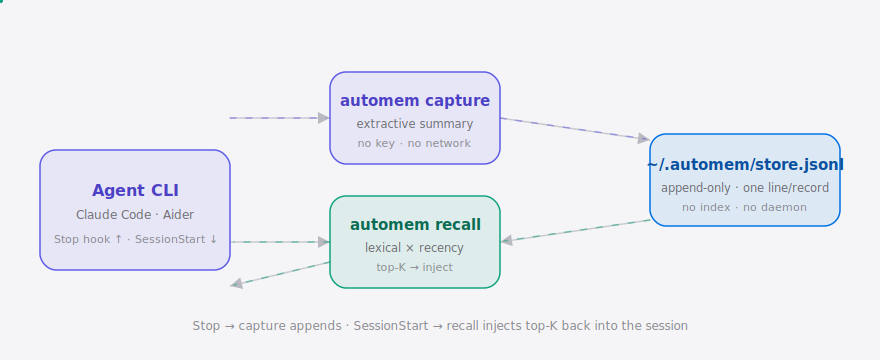

<div align="right"><sub><a href="./README.md">English</a>&nbsp;&nbsp;⇄&nbsp;&nbsp;<b>简体中文</b></sub></div>

<picture>
  <source media="(prefers-color-scheme: dark)" srcset="./assets/hero-dark.svg">
  <source media="(prefers-color-scheme: light)" srcset="./assets/hero-light.svg">
  
</picture>

<p><sub>automem 是一个离线记忆层，让任何编码 Agent 在重启后依然记得上一次会话 —— 一个二进制，无向量数据库、无账号、无密钥。</sub></p>

<p align="center">
  <a href="./LICENSE"></a>
  <a href="https://github.com/SuperMarioYL/automem/releases"></a>
  <a href="https://github.com/SuperMarioYL/automem/actions/workflows/ci.yml"></a>
  
  
  
</p>

**你的编码 Agent 每次重启都从零开始 —— 你反复粘贴上下文、反复讲解代码库、反复复述两小时前刚定下的方案。`automem` 会捕获每次会话，并把相关内容注入到下一次会话里，让 Agent 从上次停下的地方继续。**

<h2> 架构</h2>

<picture>
  <source media="(prefers-color-scheme: dark)" srcset="./assets/atlas-dark.svg">
  <source media="(prefers-color-scheme: light)" srcset="./assets/atlas-light.svg">
  
</picture>

一个二进制、一个追加式文件，无守护进程、无网络、无账号。`automem` 二进制是短命的 —— Agent 自己的进程在每次 hook 触发时调用它一次，随即退出；两次会话之间什么都不运行。捕获是确定性抽取（最近 N 条用户消息、涉及的文件路径、diff 统计），召回则对每条记录按 `词法重叠 × 时近衰减` 打分并注入 top-K —— 无嵌入、无向量数据库、无 API 密钥。

## 目录

- [为什么需要它](#为什么需要它)
- [安装](#安装)
- [快速开始](#快速开始)
- [用法](#用法)
- [演示](#演示)
- [配置](#配置)
- [对比 claude-mem](#对比-claude-mem)
- [定价](#定价)
- [路线图](#路线图)
- [参与贡献](#参与贡献)
- [许可证](#许可证)

<h2> 为什么需要它</h2>

如今要给 Agent 加上跨会话记忆，意味着挑一个服务（Mem0、Zep、ContextNest）、把它跑起来、接一个嵌入向量提供方、再注册一个账号 —— 一整套流程里，真正的摩擦是**搭建**，而不是召回质量。行业标杆 [claude-mem](https://github.com/thedotmack/claude-mem)（85k★）证明了需求存在，但它通过一次 AI 提供方调用来做压缩，因此需要密钥和网络。`automem` 把这些全部拿掉：把一个二进制丢到 `PATH` 上、跑一次 `automem install`，每个支持的 Agent 就会自动捕获、自动召回 —— 离线、无密钥，且不绑定单一 Agent。

<h2> 安装</h2>

```bash
# Homebrew（macOS / Linux）
brew install SuperMarioYL/tap/automem

# …或者一行 curl 安装脚本
curl -fsSL https://lei6393.com/automem/install | sh

# …或者从源码安装（Go 1.24+）
go install github.com/SuperMarioYL/automem/cmd/automem@latest
```

> v0.1 支持 macOS 与 Linux，Windows 见[路线图](#路线图)。

<h2> 快速开始</h2>

从冷启动到"它记住了"只要三条命令：

```bash
automem install                                   # 接入你的 Agent（Claude Code + Aider）
claude                                            # 工作一次会话然后退出 —— Stop hook 会捕获它
claude                                            # 新会话：SessionStart 召回上一次，automem stats 证明它被用到了
```

<details><summary><code>automem install</code> 的输出</summary>

```text
wired claude-code ✓, aider ✓ (unverified)
  claude-code ✓ ~/.claude/settings.json — wired SessionStart (recall) + Stop (capture) hooks
  aider ✓ ~/.local/bin/automem-aider — run `automem-aider` in place of `aider`
    [unverified: no aider on the build machine — please report if it misbehaves]
```

</details>

<h2> 用法</h2>

`automem install` 会自动接入一切，但每个子命令也能单独使用 —— 方便脚本化 Agent、CI 预热，或手动喂一份 transcript。可复制粘贴的完整往返示例见 [`examples/`](./examples)。

```bash
# 捕获：从一份会话 transcript（文件或 stdin）追加一条抽取式记录
automem capture --agent claude-code --cwd ~/proj/api session.transcript
printf 'User: refactor auth.py to use dataclasses\n' | automem capture --agent claude-code

# 召回：打印与查询最相关的 top-K 历史摘要
automem recall "上次我们对 auth.py 是怎么决定的？"
automem recall --top 3 --no-mark "http client retries"   # 只预览，不计入注入次数

# 统计：已存储 vs 已注入 —— 证明记忆真的被用到了
automem stats
```

<details><summary><code>recall</code> + <code>stats</code> 输出示例</summary>

```text
$ automem recall "what did we decide about auth.py last session?"
# memory 1/2  (score 0.800)
User: refactor auth.py to use dataclasses  User: keep the old constructor working
files: auth.py

# memory 2/2  (score 0.400)
User: add retry logic to the http client in client.py
files: client.py

$ automem stats
2 stored, 2 injected
  injection rate: 100% (2 of 2 memories recalled at least once)
  total injections: 2
  by agent:
    claude-code  2
```

</details>

付费层命令以桩（stub）形式存在，这样它们的需求量是可度量的：

```bash
automem sync    # 跨机器同步 —— 需要 automem cloud（付费层）
automem team    # 团队共享记忆 —— 需要 automem cloud（付费层）
```

<h2> 演示</h2>

两次会话，第二次记得第一次 —— 从真实二进制现场录制：


<h2> 配置</h2>

`automem` 无需配置文件 —— 开箱即用。几个环境变量可用于重定向它（供测试、沙箱和特殊环境使用）：

| 变量 | 类型 | 默认值 | 含义 |
|---|---|---|---|
| `AUTOMEM_DIR` | 路径 | `~/.automem` | 存放 `store.jsonl` 的目录。 |
| `AUTOMEM_HOME` | 路径 | 系统 home 目录 | `automem install` 接入的 home 根目录（Agent 配置路径由它派生）。 |
| `AUTOMEM_BIN` | 路径 | 解析出的可执行文件 | `automem install` 写入 hook/wrapper 时烧进去的绝对路径。 |

<h2> 对比 claude-mem</h2>

诚实地对标那个"验证了需求"的标杆 —— 它在召回质量上胜过 `automem`，而这正是为了零搭建刻意做出的取舍：

| | automem | [claude-mem](https://github.com/thedotmack/claude-mem) |
|---|:---:|:---:|
| 离线运行，无 API 密钥 | ✓ | —（通过 AI 提供方调用做压缩） |
| 无账号，无需搭向量数据库 | ✓ | 部分 |
| 多 Agent（Claude Code **与** Aider） | ✓ | —（仅 Claude Code） |
| 大规模存储下的召回质量 | 部分（词法 + 时近） | ✓（语义压缩） |
| 已验证的分发 / 社区 | —（新项目） | ✓（85k★） |

`automem` 并不去抢 claude-mem 的用户 —— 它服务的是那些因为 API 密钥和云依赖而放弃的人群。

<h2> 定价</h2>

本地底座**永久免费且开源（MIT）** —— 捕获、召回、统计、Agent 接入全部离线运行、无需账号。商业层只做本地底座刻意不免费做的那一件事：让数据离开你的机器。

| 层级 | 价格 | 内容 |
|---|---|---|
| **本地 Local** | 免费 · MIT | 单个离线二进制：捕获、召回、统计、为 Claude Code + Aider 做 `automem install`。无账号、无密钥、无网络。 |
| **同步 Sync** | 付费 | 跨机器记忆同步（`automem sync`）—— 同一份存储，出现在你写代码的每台机器上。 |
| **团队 Team** | **$8 / 席位 / 月** | 共享团队作用域 + 跨机器同步 + 审计日志（`automem team`）。为整个团队的决策、坑点、约定提供同一个记忆层。 |

`automem sync` 与 `automem team` 目前以桩形式发布，每次调用都是一次需求信号。托管后端会在兴趣到位时上线 —— 见 `lei6393.com/automem`。

<h2> 路线图</h2>

- [x] **m1 —— 存储、捕获与召回。** 追加式 JSONL 存储、确定性抽取式捕获（无密钥）、`词法 × 时近` 的 top-K 召回，以及已存储-vs-已注入的统计计数器。
- [x] **m2 —— Agent 自动接入。** `automem install` 在 macOS + Linux 上接入 Claude Code 的 `SessionStart`/`Stop` hook 与 Aider wrapper；全新的两次会话流程无需手工配置即可记住。
- [x] **m3 —— 演示与付费层桩。** `automem sync` / `team` 桩、vhs 演示，以及这份双语 README。
- [ ] 本地嵌入向量回退（仍然无账号、无云密钥），面向更大的存储。
- [ ] MCP-server 通用传输，让 Cursor、Codex CLI、Gemini CLI 自动发现同一个底座。
- [ ] 托管 `sync` / `team` 后端（付费层）。
- [ ] Windows 支持。

<h2> 参与贡献</h2>

欢迎 Issue 和 PR。Bug 或想法请[提交 Issue](https://github.com/SuperMarioYL/automem/issues)。尤其是 Aider wrapper 是以**未验证**状态发布的（未在真实 Aider 安装上测试过）—— 如果你在用 Aider，无论好坏，一份反馈都非常有价值。

<h2> 许可证</h2>

基于 [MIT 许可证](./LICENSE)发布。

<p align="center"><sub><a href="./LICENSE">MIT</a> © 2026 SuperMarioYL</sub></p>
